R 语言画图的基本参数
=======================
# 点
## 点的种类
点的种类参数为 pch，每一种符号对应一个数字编号

```r
# 点有25种，为了展示25种点
x = 1:25
y = 1:25
x
```

```
##  [1]  1  2  3  4  5  6  7  8  9 10 11 12 13 14 15 16 17 18 19 20 21 22 23
## [24] 24 25
```

```r
plot(x, x, pch = x)
# 在图上随意添加点
lines(10, 15, type = "b", pch = 5)
```

 

```r
# type的含义
plot(x, y, type = "p", pch = x)  #point 仅仅画出点
```

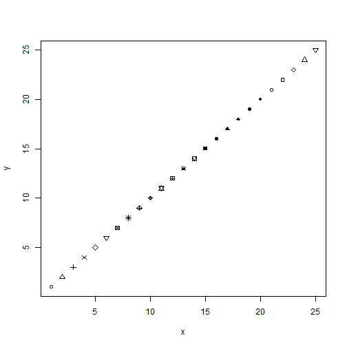 

```r
plot(x, y, type = "l", pch = x)  #line 仅仅画出线
```

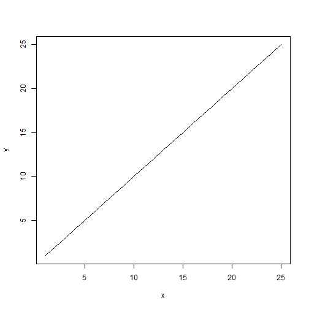 

```r
plot(x, y, type = "b", pch = x)  #both 同时画出点线,注意和o的区别,没有覆盖
```

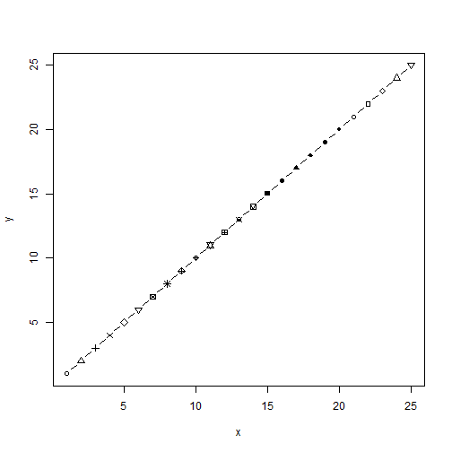 

```r
plot(x, y, type = "c", pch = x)  #  画出线，但是点所在的位置为空
```

 

```r
plot(x, y, type = "o", pch = x)  #overlap  画出点线，线覆盖点
```

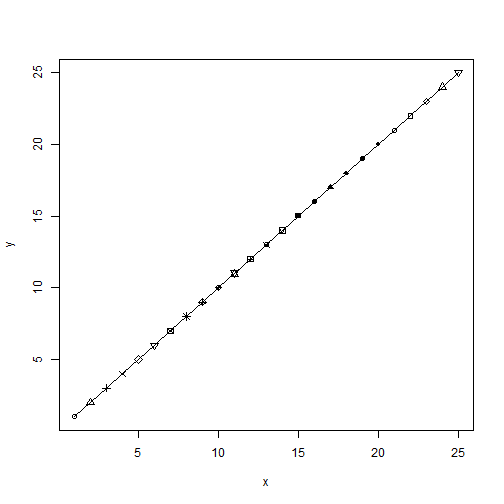 

```r
plot(x, y, type = "s", pch = x)  #step  台阶
```

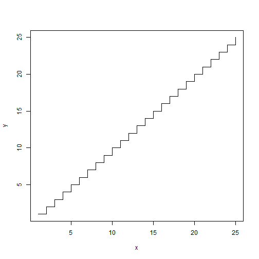 

```r
plot(x, y, type = "h", pch = x)  #hist  类似直方图
```

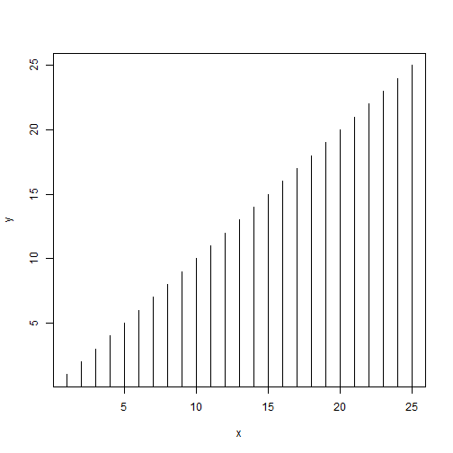 

```r
plot(x, y, type = "n", pch = x)  #none  一个空白
```

 

```r

```

## 点的大小
点的大小的参数为cex

```r
plot(x, x, pch = x, cex = x)
```

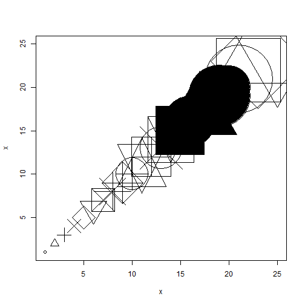 

# 线
## 线的种类
线的种类参数为lty

```r
# 首先来一个比较简单的数据
a = c(1, 10)
plot(a, a, type = "b", lty = 1)
```

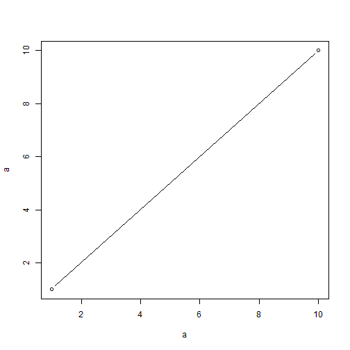 

```r
plot(a, a, type = "b", lty = 2)
# 6种线，分别对应lty = 1，2，3，4，5，6
# 通过在图上添加参考线来认识一下这六种线 添加参考线的函数为abline ?abline()
b = 1:6
abline(h = b, lty = b)
abline(v = b, lty = b)
abline(a = 4, b = 5, lty = b)
abline(a = 0, b = 5, lty = b)
```

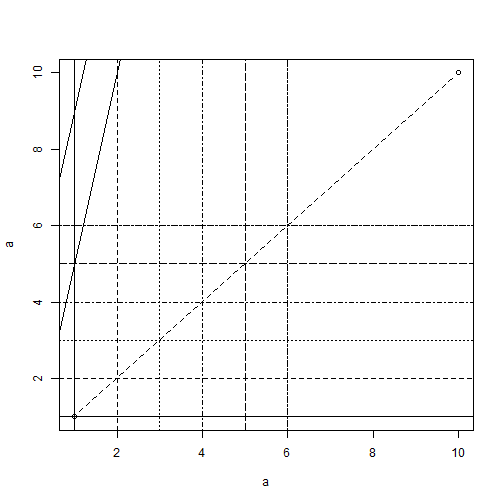 

## 线的粗细
线的粗细的参数为lwd

```r
abline(h = b, lty = b, lwd = b)
```

```
## Error: plot.new has not been called yet
```

```r
plot(x, y, lwd = 1)
plot(a, a, type = "b", lwd = 5)
plot(a, a, type = "b", lwd = 1)
```


# 色
色的参数为col

```r
# 颜色可以用我们单词表示
plot(x, x, col = "blue", pch = 20)  #颜色名称
```

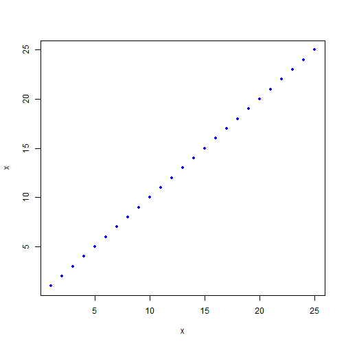 

```r
plot(x, x, col = "red", pch = 20)  #颜色名称
```

 

```r

# 或者用数字表示
plot(x, x, col = 1, pch = 20)  #颜色下标
```

 

```r
plot(x, x, col = 2, pch = 20)
```

 

```r
plot(x, x, col = "#FFFFFF", pch = 20)  #16进制颜色值
```

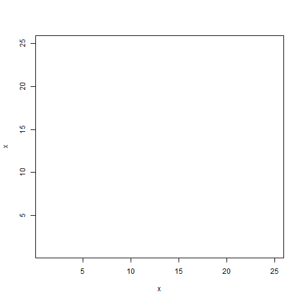 

```r
plot(x, x, col = "#0000FF", pch = 20)  #蓝色
```

 

```r
plot(x, x, col = rgb(0.5, 0.5, 0.5), pch = 20)  #RGB red,green,black
```

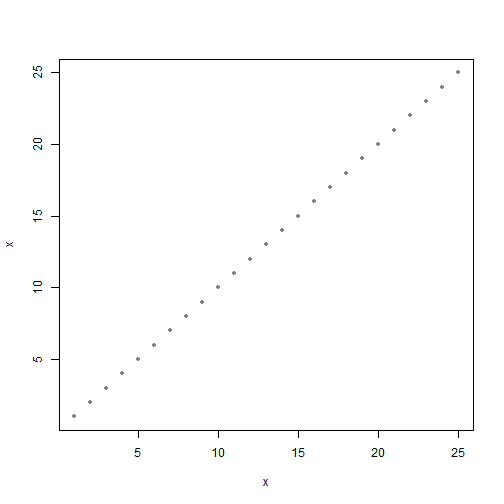 

```r
plot(x, x, col = hsv(0, 0, 0.5), pch = 20)  #hsv 色相-饱和度-亮度

# 彩虹型颜色
plot(x, x, col = rainbow(10), pch = 20)
```

 

```r
pie(rep(1, 10), col = rainbow(10))
```

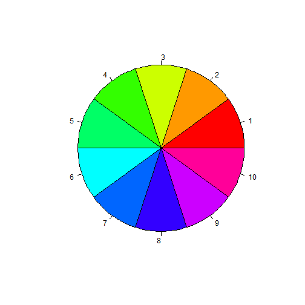 

```r
# 多阶灰度
pie(rep(1, 10), col = gray(0:10/10))
```

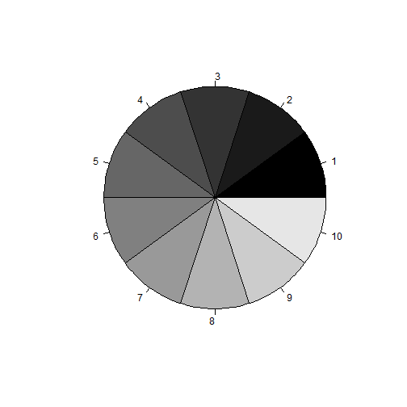 

我们肯定是记不住这么多颜色的，所以这里有一个专门整理好的网站，供我们参考
http://research.stowers-institute.org/efg/R/Color/Chart/
