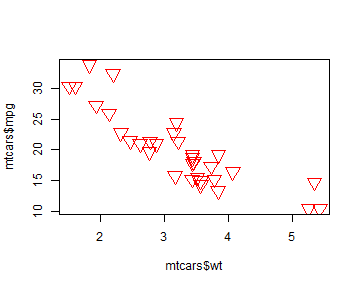
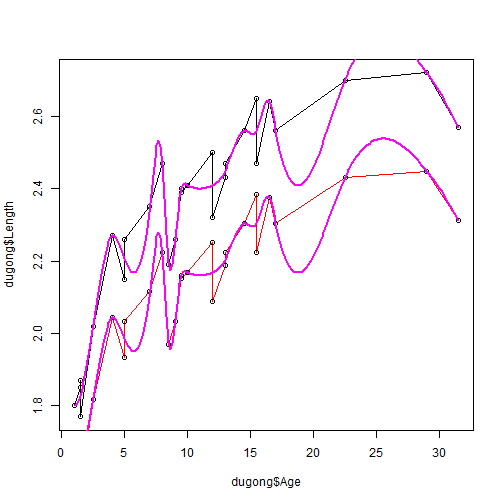
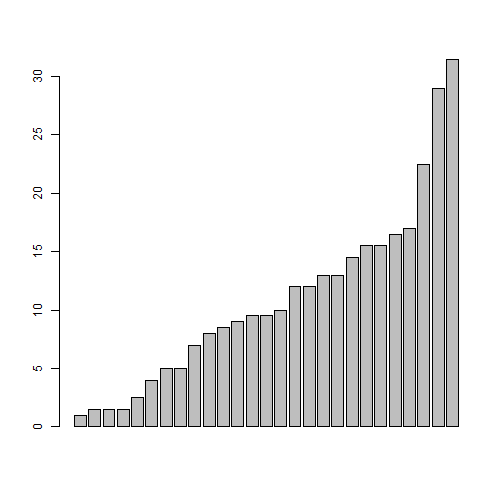
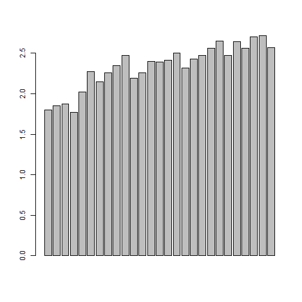

# 用R的基础作图系统和ggplot2做常用图
这里我们会用R语言中的基础作图系统和ggplot2中的qplot以及ggplot作常见的图。
拨号下面几种常见的图：
* 散点图
* 线图
* 条形图
* 直方图,和密度图
* 箱线图
* 饼图
* 扇形图
常见的图形的代码都在下面的网站里。
http://docs.ggplot2.org/current/

## 数据集
某种动物的年龄和体长

```r
dugong = read.table("dugongs.txt", header = TRUE)
```


## ggplot2的安装,和载入

```r
# install.packages('ggplot2')
library(ggplot2)
```


## 散点图 

```r
plot(dugong$Age, dugong$Length, col = "red")
```

 

```r

# colour控制颜色
qplot(Age, Length, data = data, geom = "point", colour = "red")
```

```
## Error: ggplot2 doesn't know how to deal with data of class function
```

```r

qplot(data$Age, data$Length, geom = "point", colour = "red")
```

```
## Error: 类别为'closure'的对象不可以取子集
```

```r

ggplot(data, aes(x = Age, y = Length)) + geom_point()
```

```
## Error: ggplot2 doesn't know how to deal with data of class function
```

# 线图

```r
plot(dugong$Age, dugong$Length, type = "l")
# 在线上添加点
points(dugong$Age, dugong$Length)
dugong$Length1 = dugong$Length * 0.9
# 添加一条线
lines(dugong$Age, dugong$Length1, col = "red")
points(dugong$Age, dugong$Length1)
# 添加平滑曲线
lines(spline(dugong$Age, dugong$Length, n = 201), col = 454, lwd = 2)
lines(spline(dugong$Age, dugong$Length1, n = 201), col = 454, lwd = 2)
```

 

```r

qplot(Age, Length, data = data, geom = "line")
```

```
## Error: ggplot2 doesn't know how to deal with data of class function
```

```r
qplot(Age, Length, data = data, geom = c("line", "point"))
```

```
## Error: ggplot2 doesn't know how to deal with data of class function
```

```r
qplot(Age, Length, data = data, geom = c("line", "point"))
```

```
## Error: ggplot2 doesn't know how to deal with data of class function
```

```r
qplot(Age, Length, data = data, geom = c("line", "point", "smooth"))
```

```
## Error: ggplot2 doesn't know how to deal with data of class function
```

```r


ggplot(data, aes(x = Age, y = Length)) + geom_line()
```

```
## Error: ggplot2 doesn't know how to deal with data of class function
```

```r
ggplot(data, aes(x = Age, y = Length)) + geom_line() + geom_point() + geom_smooth()
```

```
## Error: ggplot2 doesn't know how to deal with data of class function
```

## 条形图

```r
dugong
```

```
##     Age Length Length1
## 1   1.0   1.80   1.620
## 2   1.5   1.85   1.665
## 3   1.5   1.87   1.683
## 4   1.5   1.77   1.593
## 5   2.5   2.02   1.818
## 6   4.0   2.27   2.043
## 7   5.0   2.15   1.935
## 8   5.0   2.26   2.034
## 9   7.0   2.35   2.115
## 10  8.0   2.47   2.223
## 11  8.5   2.19   1.971
## 12  9.0   2.26   2.034
## 13  9.5   2.40   2.160
## 14  9.5   2.39   2.151
## 15 10.0   2.41   2.169
## 16 12.0   2.50   2.250
## 17 12.0   2.32   2.088
## 18 13.0   2.43   2.187
## 19 13.0   2.47   2.223
## 20 14.5   2.56   2.304
## 21 15.5   2.65   2.385
## 22 15.5   2.47   2.223
## 23 16.5   2.64   2.376
## 24 17.0   2.56   2.304
## 25 22.5   2.70   2.430
## 26 29.0   2.72   2.448
## 27 31.5   2.57   2.313
```

```r
# 显示27个Age
barplot(dugong$Age)
```

 

```r
barplot(dugong$Length)
```

 

```r
# ggplot的bar有所不同
```

## 直方图-核密度图


## 箱线图


## 饼图


## 扇形图


