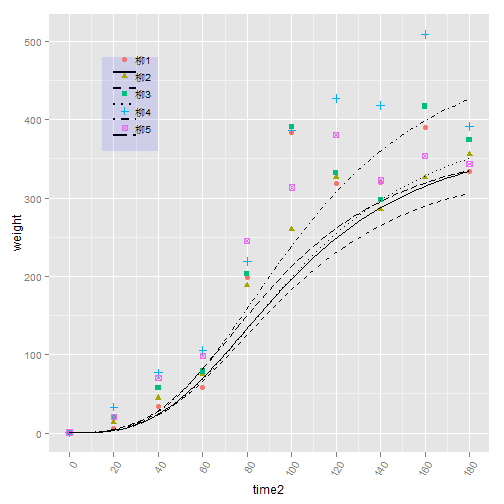

```r
library(ggplot2)
library(scales)
# library(grid) library(gridBase)
data <- read.table("a.csv", sep = ",", header = TRUE)


class(data$time)
```

```
## [1] "factor"
```

```r
data$time = as.Date(data$time)
class(data$time)
```

```
## [1] "Date"
```

```r
start = as.Date("2011-04-13")
data$time1 = data$time - start
data$time2 = as.numeric(data$time1)

first = c(390.4, 355.95, 416.75, 509, 380.55)
second = c(390.38, 355.88, 416.661, 508.78, 380.09)
third = c(99.544, 98.133, 103.235, 104.264, 92.552)
data1 = matrix(c(first, second, third), 5, 3)
colnames(data1) = c("a", "b", "c")
rownames(data1) = c("柳1", "柳2", "柳3", "柳4", "柳5")
data1
```

```
##         a     b      c
## 柳1 390.4 390.4  99.54
## 柳2 355.9 355.9  98.13
## 柳3 416.8 416.7 103.23
## 柳4 509.0 508.8 104.26
## 柳5 380.6 380.1  92.55
```

```r
# data

myfun1 = function(xvar) {
    390.4 - 390.38/(1 + (xvar/99.544)^3)
}
myfun2 = function(xvar) {
    355.95 - 355.88/(1 + (xvar/98.133)^3)
}
myfun3 = function(xvar) {
    416.75 - 416.661/(1 + (xvar/103.235)^3)
}
myfun4 = function(xvar) {
    509 - 508.78/(1 + (xvar/104.264)^3)
}
myfun5 = function(xvar) {
    380.55 - 380.09/(1 + (xvar/92.552)^3)
}

# cols <-
# c('LINE1'='#f04546','LINE2'='#3591d1','BAR'='#62c76b','BAR'='#62c76b','ba','#62c76b')

# ggplot(data,aes(time2,weight,shape=type,colour=type,linetype=type))+
# geom_line(linetype=type)+
ggplot(data, aes(time2, weight, shape = type, colour = type, linetype = type)) + 
    geom_point(size = 2.5) + scale_x_continuous(breaks = seq(0, 180, by = 20)) + 
    labs(shape = "") + labs(colour = "") + # theme(legend.position='none')+
theme(legend.position = c(0.26, 0.688), legend.justification = c(1, 0)) + theme(legend.background = element_blank()) + 
    theme(legend.key = element_blank()) + theme(axis.text.x = element_text(angle = 60, 
    hjust = 1)) + # stat_function(fun=data$a-data$b/(1+data$time2/data$))
stat_function(fun = myfun1, geom = "line", colour = "black", linetype = 1) + 
    stat_function(fun = myfun2, geom = "line", colour = "black", linetype = 2) + 
    stat_function(fun = myfun3, geom = "line", colour = "black", linetype = 3) + 
    stat_function(fun = myfun4, geom = "line", colour = "black", linetype = 4) + 
    stat_function(fun = myfun5, geom = "line", colour = "black", linetype = 5) + 
    # 加线
annotate("segment", x = 20, xend = 30, y = 460, yend = 460, linetype = 1, size = 1) + 
    annotate("segment", x = 20, xend = 30, y = 440, yend = 440, linetype = 2, 
        size = 1) + annotate("segment", x = 20, xend = 30, y = 420, yend = 420, 
    linetype = 3, size = 1) + annotate("segment", x = 20, xend = 30, y = 400, 
    yend = 400, linetype = 4, size = 1) + annotate("segment", x = 20, xend = 30, 
    y = 380, yend = 380, linetype = 5, size = 1) + # 可以用geom_point添加单独一个点
# geom_point(x=18,y=460,shape=16,colour='red',size=4)+ 加框
annotate("rect", xmin = 15, xmax = 40, ymin = 360, ymax = 480, alpha = 0.1, 
    fill = "blue")
```

 

```r

# scale_colour_manual(name='a',values=cols)

# plot.new() grid.newpage()
pushViewport(viewport(layout = grid.layout(1, 2)))
```

```
## Error: 没有"pushViewport"这个函数
```

```r

pushViewport(viewport(layout.pos.col = 1))
```

```
## Error: 没有"pushViewport"这个函数
```

```r
print(base, newpage = FALSE)
```

```
## Error: 找不到对象'base'
```

```r
popViewport()
```

```
## Error: 没有"popViewport"这个函数
```

```r
pushViewport(viewport(layout.pos.col = 2))
```

```
## Error: 没有"pushViewport"这个函数
```

```r
par(fig = gridFIG(), new = TRUE)
```

```
## Error: 没有"gridFIG"这个函数
```

```r

legend("topleft", inset = 0.05, title = "Drug Type", c("A", "B"), lty = c(1, 
    2), pch = c(15, 17), col = c("red", "blue"))
```

```
## Error: plot.new has not been called yet
```

```r
popViewport()
```

```
## Error: 没有"popViewport"这个函数
```

```r
# ?linetype
```


# 

```r
ggplot(data, aes(time2, weight, shape = type, colour = type, linetype = type)) + 
    geom_point(size = 2.5) + scale_x_continuous(breaks = seq(0, 180, by = 20)) + 
    labs(shape = "howareyou") + labs(colour = "howareyou") + geom_smooth(method = "nlm") + 
    `?`(geom_smooth)
```

```
## Error: Don't know how to add `?`(geom_smooth) to a plot
```

```r
# theme(legend.position='none')+
theme(axis.text.x = element_text(angle = 60, hjust = 1))
```

```
## List of 1
##  $ axis.text.x:List of 8
##   ..$ family    : NULL
##   ..$ face      : NULL
##   ..$ colour    : NULL
##   ..$ size      : NULL
##   ..$ hjust     : num 1
##   ..$ vjust     : NULL
##   ..$ angle     : num 60
##   ..$ lineheight: NULL
##   ..- attr(*, "class")= chr [1:2] "element_text" "element"
##  - attr(*, "class")= chr [1:2] "theme" "gg"
##  - attr(*, "complete")= logi FALSE
```

# 下面讲了横坐标为时间的时候的划分

```r
ggplot(data, aes(time1, weight, shape = type, colour = type)) + geom_line() + 
    geom_point(size = 2.5) + scale_x_date(breaks = date_breaks("20 days"), labels = date_format("%m-%d")) + 
    theme(axis.text.x = element_text(angle = 60, hjust = 1))
```

```
## Error: Invalid input: date_trans works with objects of class Date only
```

```r
# stat_function(fun=myfun,geom='line')
```

